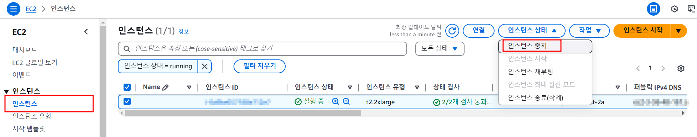
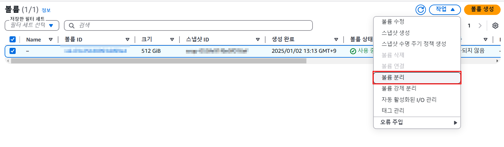
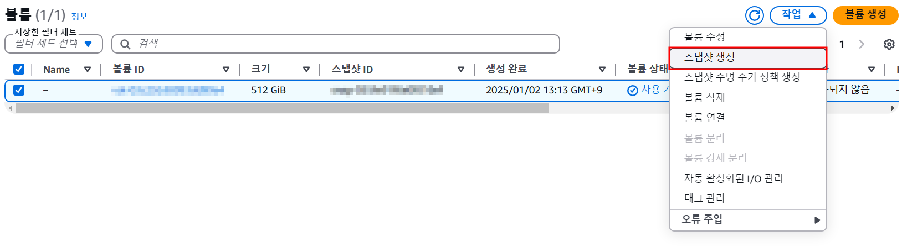
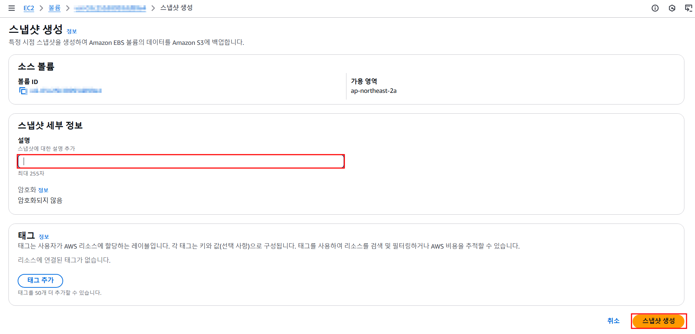
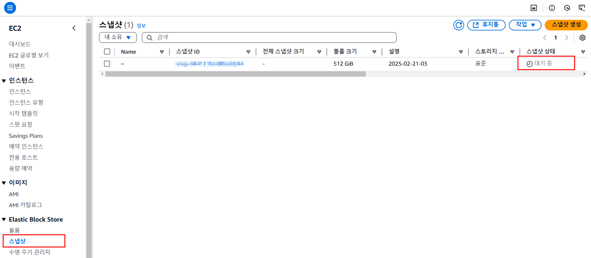
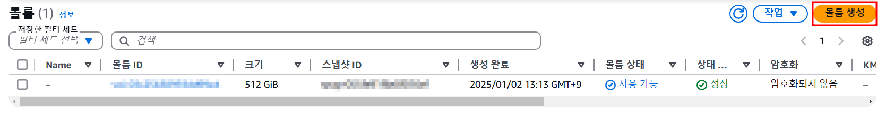
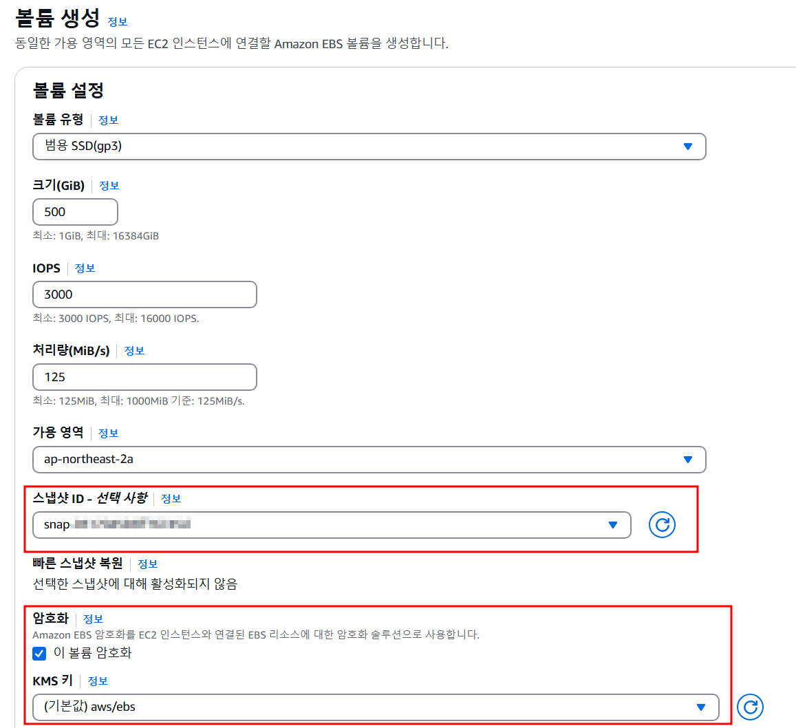
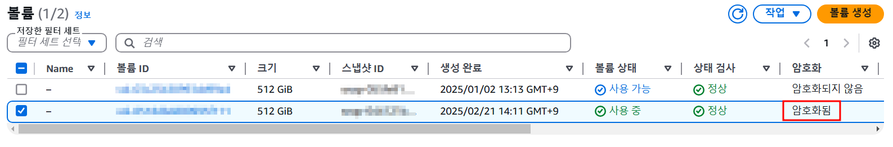
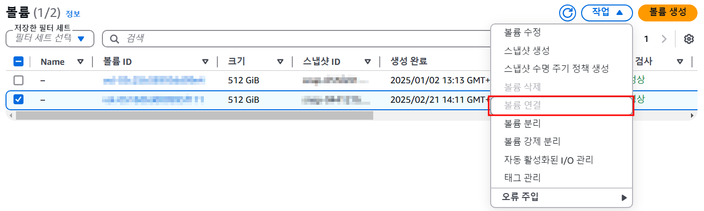
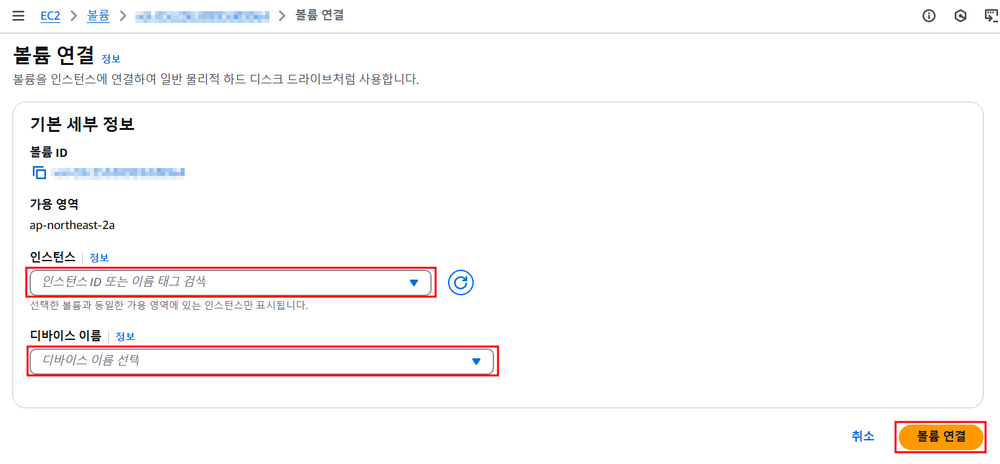

## ☀️ 테스트 환경
> - AWS Console

## ✋ 들어가며
개인정보보호법과 정보통신망법 기준을 충족하기 위해서 이미 생성 후 사용중인 Amazon EBS 볼륨의 암호화가 필요했다.
글을 쓰고 있는 지금(2025-02-24)를 기준으로 이미 생성된 EBS 볼륨의 암호화 설정을 변경하는 것은 불가능하기 때문에 다른 방법이 필요했다.

## 🏫 EBS란?
우리가 아는 그 교육 방송 말고 EBS(Elastic Block Store)는 AWS에서 제공하는 블록 스토리지 서비스로 EC2에 연결해서 사용할 수 있는 스토리지 볼륨을 제공한다.
블록 단위로 데이터를 저장하며 EC2 인스턴스가 종료되더라도 데이터가 유지된다는 특징이 있다.

더 자세한 내용이 궁금하다면 [여기↗](https://aws.amazon.com/ko/ebs/) 공식 홈페이지를 살펴보자.

## 🔒 EBS 암호화하기
AWS EBS를 암호화하기 위해서는 크게 6단계의 과정이 필요한데 모두 AWS Console에서 이루어지며 EC2 중지와 시작과 같은 간단한 절차로 구성되어있어서 큰 어려움은 없을 것으로 예상이 된다.

가장 먼저 암호화되지 않은 볼륨을 확인하고 천천히 한걸음씩 따라가보자.

#### ***1. EC2 중지***
`EC2 ➡ 인스턴스`

암호화가 필요한 EBS 볼륨이 연결된 EC2를 중지한다. 현재를 기준으로 스냅샷을 생성할 예정이기 때문에 더이상의 업데이트가 이루어지지 않도록 한다.

#### ***2. EBS 볼륨 분리***
`EC2 ➡ Elastic Block Store ➡ 볼륨`

암호화되지 않은 EBS 볼륨을 EC2에서 분리해준다.

#### ***3. 스냅샷 생성***
`EC2 ➡ Elastic Block Store ➡ 볼륨`

분리된 EBS 볼륨의 스냅샷을 생성한다.

`EC2 ➡ Elastic Block Store ➡ 스냅샷`

스냅샷 화면에서 생성된 스냅샷을 확인 할 수 있고 스냅샷의 상태가 '완료됨'으로 표시되어야 다음 단계로 넘어갈 수 있다.
필자는 512GB의 볼륨의 스냅샷을 생성하는데 거의 2시간이 소요된 것 같다.

#### ***4. 암호화 EBS 볼륨 생성***
`EC2 ➡ Elastic Block Store ➡ 볼륨`

스냅샷의 생성이 완료되었다면 해당 스냅샷을 이용해서 암호화된 볼륨을 생성할 차례이다.

데이터 복원을 위해서 생성된 스냅샷 ID를 선택해주고 우리의 목표인 볼륨 암호화를 꼭 체크해준다. 

아래와 같이 암호화된 볼륨이 생성되면 정상이고 암호화되지 않은 기존 볼륨은 삭제해도 좋다.

#### ***5. EBS 볼륨 연결***

거의 마지막까지 왔는데 이 단계에서는 지금까지 생성한 암호화된 EBS 볼륨을 기존 EC2에 연결해준다.
(필자는 연결 후에 화면을 캡쳐해서 '볼륨 연결'이 비활성화 되어있다.)

연결할 EC2 인스턴스를 선택하고 기존에 연결되어있던 디바이스 이름을 선택한다.
별도의 설정이 없었다면 대부분 `/dev/xvda`으로 되어있다.

#### ***6. EC2 시작***
마지막으로 1번 단계에서 중지했던 EC2를 시작하면 끝.
이 과정도 평소의 시간보다는 조금 더 오래걸리고 퍼블릭 IP와 DNS가 변경되니 놀라지말자.

## 👋 마치며
어느새 벌써 24번째 게시글인데 여전히 방문자는 없다.