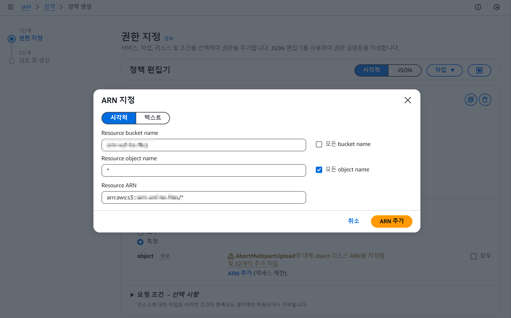
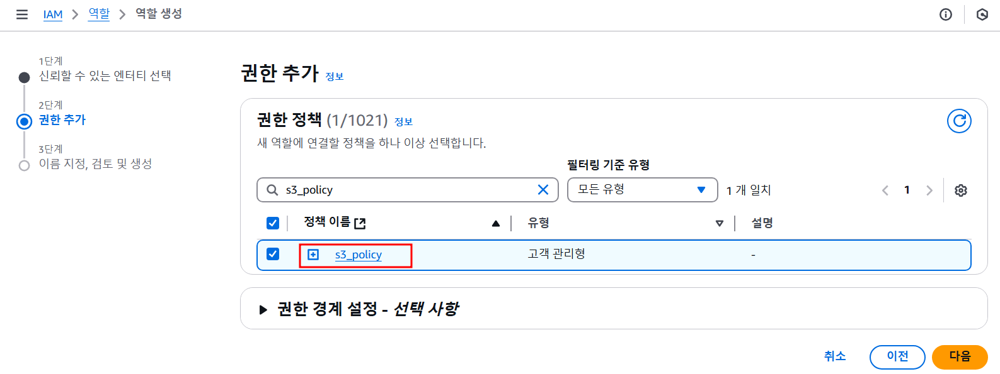
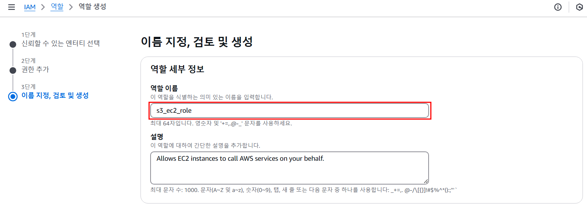

> ☀️ ***테스트 환경***
>   
> - AWS Console

## ✋ 들어가며

파일 업로드/다운로드 기능을 구현할때 지금도 많은 서비스들이 백엔드 프로세스에서 파일을 읽은 후 업로드하거나 다운로드하는 방식을 사용하고 있다.
Object Storage에 하나인 Amazon S3에 Presigned URL을 통해서 파일을 업로드/다운로드하기 위해서 이 글에서는 Amazon EC2에 S3 Bucket 접근 권한을 주는 일련의 과정을 설명하려고 한다.

## ❓ Amazon S3(Object Storage)를 선택한 이유

1. 일반적인 File Storage에 비해서 Object Storage를 사용하면 매우 높은 확장성이 보장되며 사용한 만큼만 비용을 지불하기 때문에 초기 비용이 낮다.
2. Amazon S3에 특정 시간동안만 유효한 Presigned URL을 사용해서 파일에 접근하면 불필요한 접근을 방지할 수 있다.
3. 데이터 분산 저장으로 저장 데이터 손실에 대한 부담이 매우 낮다.

#### ***Object Storage란?***
> 오브젝트 스토리지(object storage) 또는 오브젝트 기반 스토리지(object-based storage)는 섹터와 트랙 내에 데이터를 블록으로 관리하는 블록 스토리지, 파일 계층으로서 데이터를 관리하는 파일 시스템과 같은 다른 스토리지 구조와는 반대로 데이터를 오브젝트로 관리하는 기억 장치이다. 각 스토리지는 여러 레벨로 구현될 수 있는데, 여기에는 장치 레벨, 시스템 레벨, 인터페이스 레벨이 있다. 각 케이스에서 오브젝트 스토리지는 다른 스토리지 구조에 의해 언급되지 않는 기능들을 가능케 하려고 노력하는데, 애플리케이션에 의해 직접 프로그래밍 가능한 인터페이스라든지, 물리 하드웨어의 여러 인스턴스를 검색할 수 있는 이름공간이라든지, 데이터 레플리케이션과 같은 데이터 관리 기능이라든지, 오브젝트 레벨의 입도의 데이터 분산을 들 수 있다.
>   
> 출처 : [위키백과↗](https://ko.wikipedia.org/wiki/오브젝트_스토리지)

#### ***Object Storage VS File Storage***

| 특성  | Object Storage (S3)          | File Storage                      |
|-----|------------------------------|-----------------------------------|
| 구조  | 데이터가 객체로 저장되며, 메타데이터와 함께 관리됨 | 파일 시스템 구조로, 폴더와 파일로 구성됨           |
| 확장성 | 매우 높은 확장성, 수 페타바이트 이상 저장 가능  | 제한된 확장성, 하드웨어에 따라 다름              |
| 성능  | 객체 접근 시 지연이 있을 수 있음          | 빠른 접근 속도, 동시 사용량에 따라 서버 부하 가능성 있음 |
| 내구성 | 높은 내구성, 데이터 복제 및 분산 저장 가능    | 하드웨어 고장 시 데이터 손실 위험이 있음           |
| 비용  | 사용한 만큼 지불하는 구조로 초기 비용이 낮음    | 초기 투자 비용이 높을 수 있으며, 유지 관리 비용 발생   |

## 🛠 AWS Console 설정
Presigned URL로 파일을 업로드/다운로드하기 위해서는 S3 Bucket은 물론이고 필요에 따라 IAM 정책 및 역할 설정을 해야한다.

#### ***S3 Bucket 생성***
먼저 가장 중요한 S3 Bucket을 생성해주자.

1. *Amazon S3 ➡ 버킷 만들기*

   

2. 파일에 대한 접근은 Presigned URL을 통해서만 이루어질 예정이기 때문에 퍼블릭 엑세스를 차단했다.

   
3. CORS 에러를 방지하기 위해서 접근 가능한 프론트 도메인을 설정했다.

   

#### ***IAM 정책 설정***
S3에 파일을 업로드/다운로드할 수 있는 권한 정책을 생성한다.

1. *IAM ➡ 정책 ➡ 정책 생성*

   

2. S3 선택 후 GetObject, GetObjectAcl, PutObject, PutObjectAcl 작업을 허용해준다. (*Acl을 허용하지 않으면 403 에러 발생)

   

3. 앞에서 생성한 S3 Bucket 명을 입력하고 모든 하위 Object에 접근 가능하도록 `*` 입력한다.

   
4. 마지막으로 정책 이름을 설정한다.

   

#### ***IAM 역할 설정***
이 단계에서는 위에서 생성한 정책을 EC2 역할로 설정한다.  

1. *IAM ➡ 역할 ➡ 역할 생성*

   

2. 엔티티 유형을 AWS 서비스로 선택하고 사용 사례를 EC2로 선택

   

3. 위에서 생성한 정책 선택

   

4. 역할의 이름을 설정한다.

   

5. *EC2 인스턴스 ➡ 작업 ➡ 보안 ➡ IAM 역할 수정*

   

6. 위에서 생성한 역할을 선택하면 끝

   

## 👋
다음 글에서는 백엔드(Spring Boot)에서 실제로 어떻게 Presigned URL을 생성하고 프론트(React)에서 파일에 접근하는지를 알아봐야겠다.
