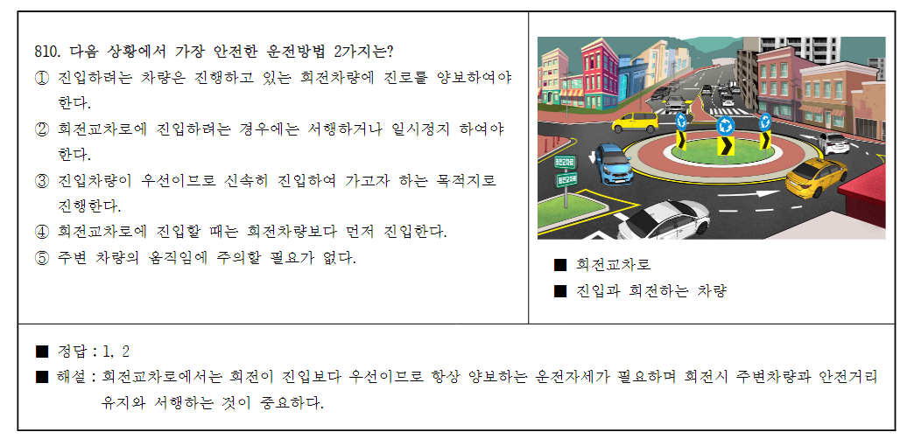
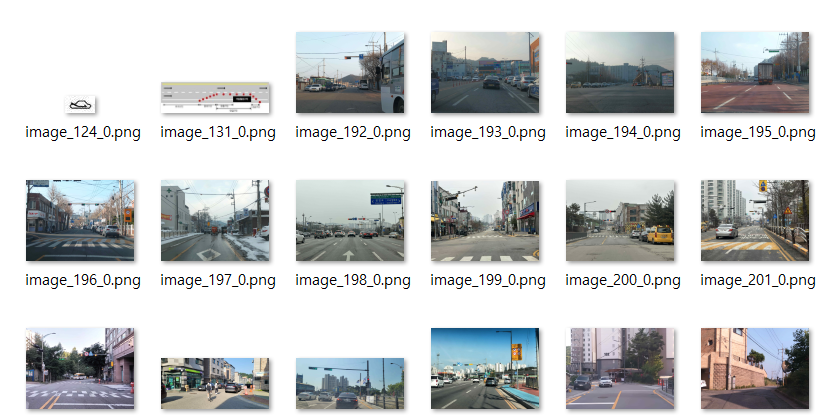
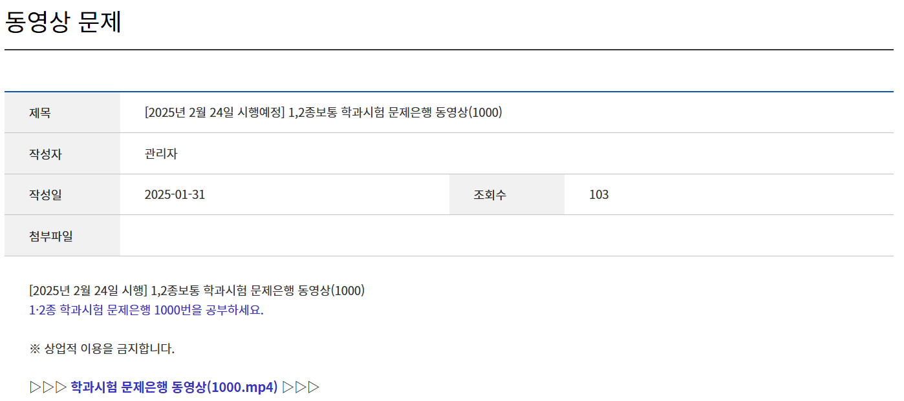

import DisplayAd from "../../src/components/DisplayAd"
---
emoji: "💾"
title: "운전면허 학과시험 문제은행 DB 만들기 2"
date: 2025-02-05 11:00:00 +0900
update: 2025-02-05 11:00:00 +0900
tags:
  - 에세이
  - 앱만들기
series: "💰 무작정 모바일 앱 출시하기"
---

## 🏗️ 데이터를 만들어볼까?

본격적으로 운전면허 학과시험 문제은행 DB를 만들었던 과정을 작성하려고 한다.
이 과정이 완전한 자동이었으면 좋겠지만 수작업이 ktn 포함되어있어서 소스코드의 언급은 최소화하려고 한다.

> 👨‍🍳 *자동인데.. 그 약간 수동을 곁들인..*

## 🔤 일단 PDF에서 텍스트만 뽑아내자



한국도로교통공단에서 제공하는 PDF는 위와 같은 형태로 구성이 되어있고
문항의 수, 정답의 수, 이미지 포함 여부, 이미지 설명 포함 여부 등이 문제마다 조금씩 다르다.

#### ***모르겠고..***

이미지나 동영상은 일단 지금 모르겠고 아무 생각도 안나니까 나중에 생각할거고 비교적 간단해보이는(?) 텍스트라도 먼저 뽑아보자는게 내 생각이었다.

#### ***PDF에서 텍스트 출력하기***

아래와 같은 간단하게 만든 자바 소스로 PDF에 포함된 모든 텍스트를 출력할 수 있었다.

```JAVA
// org.apache.pdfbox:podfbox:2.0.29
PDDocument doc = PDDocument.load(new File("../question_bank.pdf"));
String text = new PDFTextStripper().getText(doc);
...
```

아래와 같이 텍스트를 출력했더니 앞에 3문제만 뽑아왔는데도 문제에 줄바꿈이 있는 경우, 한줄에 문항이 여러개인 경우 등 정형화되지 않은 패턴들이 보이기 시작했다.
게다가 패턴과 다르게 띄어쓰기가 표함된 경우, 문항 번호가 로마 숫자로 표기된 경우, 심지어는 문항 번호가 없는 경우 등의 패턴을 알 수 없는 단순 오타들도 많이 포함되어 있었다.  

```text
[예시]

1. 다음 중 총중량 1.5톤 피견인 승용자동차를 4.5톤 화물자동차로 견인하는 경우 필요한 운전면허에 해당하지 않은 
것은?
 ① 제1종 대형면허 및 소형견인차면허  ② 제1종 보통면허 및 대형견인차면허
 ③ 제1종 보통면허 및 소형견인차면허  ④ 제2종 보통면허 및 대형견인차면허
■ 정답：4
■ 해설：도로교통법 시행규칙 별표18 총중량 750킬로그램을 초과하는 3톤 이하의 피견인 자동차를 견인하기 위해서는 견인
하는 자동차를 운전할 수 있는 면허와 소형견인차면허 또는 대형견인차면허를 가지고 있어야 한다.

2. 도로교통법령상 운전면허증 발급에 대한 설명으로 옳지 않은 것은? 
 ① 운전면허시험 합격일로부터 30일 이내에 운전면허증을 발급받아야 한다.
 ② 영문운전면허증을 발급받을 수 없다. 
 ③ 모바일운전면허증을 발급받을 수 있다.
④ 운전면허증을 잃어버린 경우에는 재발급 받을 수 있다.
■ 정답：2
■ 해설：도로교통법시행규칙 제77조∼제81조

3. 시·도경찰청장이 발급한 국제운전면허증의 유효기간은 발급받은 날부터 몇 년인가?
 ① 1년    ② 2년  ③ 3년  ④ 4년
■ 정답：1
■ 해설：도로교통법 제98조에 따라 국제운전면허증의 유효기간은 발급받은 날부터 1년이다.
...
```

그래서 원하는 패턴이 아닌 경우를 찾아내는 검증 로직이 필요해졌다. (~~아 귀찮아~~)

<DisplayAd/>

## 🔎 정형화되지 않은 패턴 찾기

#### ***원하는 패턴***

내가 원하는 정형화된 패턴의 최종 모습은 아래와 같은 모습이었다.

```text
[예시]

724. 다음 상황에서 가장 안전한 운전방법 2가지는?
 ① 도로 공사 중이므로 전방 상황을 잘 주시하며 운전한다.
 ② 노면이 고르지 않으므로 속도를 줄이지 않고 빠르게 진행하는 것이 안전하다.
 ③ 맞은편에서 진행하는 차량에 주의하며 서행한다.
 ④ 경음기를 계속 사용하며 우측의 주차되어 있는 공사 차량에 경고하고 속도를 높여 신속하게 진행한다.
 ⑤ 맞은편에서 진행하는 차량이 가까워질 때까지 속도를 유지하다가 급정지한다. 
■ 공사 중인 도로
■ 맞은편에서 진행해오는 차량
■ 길 우측에 주차시켜 놓은 공사 차량
■ 정답 : 1, 3
■ 해설 : 공사 중인 이면도로에서는 돌발 상황에 대비하여 속도를 줄이고 예측·방어·양보 운전한다.
```

순서대로 살펴보면 아래와 같다.

1. 첫줄에는 문항 번호가 포함된 문제
2. 이후 4~5줄에는 문항
3. 이후 정답 라인이 나오기 전 이미지의 설명이 있다면 표시
4. 정답 표시
5. 해설이 여러줄 표시

#### ***패턴 검증 로직 작성***

PDF에서 뽑아낸 텍스트를 한줄씩 읽으면서 패턴에 맞지 않는 라인을 로그에 남기고
혹시모르는 상황에 대비해서 최대한 눈으로 확인하는 과정을 거치고 수정 로직을 만들어서 변경하거나 경우에 따라서는 수작업으로 텍스트를 변경했다.
너무 많은 패턴이 존재했기 때문에 이 과정이 가장 오래 걸리는 작업이었다.

```JAVA
// 한줄에 ①, ②가 같이 있는 경우
if (line.contains("①") && line.contains("②")) {
    System.out.println(nowQuestionNumber - 1 + " " + line);
}

...
```

#### ***그래서 결과는?***

위에서 가공한 텍스트에 문제 유형과 점수를 포함해서 아래와 같은 JSON 구조로 변환했다.
이미지와 동영상은 어떤식으로 관리할지 아직 고민중에 있고 화면을 만들어나가는 단계에서 구체화할 예정이다.

```json
[가공된 데이터]

...
{
  "type": 3,
  "score": 3,
  "num": 800,
  "question": "왼쪽차로(1차로)에서 직진하며 교차로에 접근하고 있는 상황이다. 안전한 운전방법 2가지는?",
  "choice1": "반대쪽 방향에 차가 없으므로 왼쪽으로 앞지르기하여 통과한다.",
  "choice2": "감속하며 1차로 택시와 안전한 거리를 두고 접근한다.",
  "choice3": "경음기을 사용하여 택시를 멈추게 하고 택시의 오른쪽으로 빠르게 통행한다.",
  "choice4": "3차로로 연속 진로변경하여 정차한다.",
  "choice5": "2차로로 진로변경하는 경우 택시와 보행자에 접근 시 감속한다. ",
  "description1": "교통정리가 없는 교차로",
  "description2": "양방향 주차된 차들",
  "description3": "오른쪽 후사경에 접근 중인 승용차",
  "answer": "2,5",
  "explanation": "1차로에 통행중인 택시가 오른쪽 보행자를 확인하고 제동하며... \n..."
},
...
```

위 JSON 데이터는 사실 최종 모습이 아니다.
필자는 데이터를 최대한 사용하지 않는 앱을 원하기 때문에 JSON 데이터를 에셋에 포함시켜야하는데
이전 글에서 내가 했던 것 처럼 내 앱의 압축을 풀었을때 데이터들을 알아보기 어렵게 하기 위해서 암호화를 진행했다. 

드디어 PDF에 포함된 텍스트들이 내가 원하는 모습으로 변했다.

```text
[암호화된 데이터]

6LsRfvEAyS8BWCQ+8+kKDe8GQot9EJsMyQf3rpPqAXDC55z2+pIVsf0pKAM6cUbwS+8+kKDe8GQot9EJsMyQ...
```

## 🖼️ 이미지와 동영상은 어떻게?

#### ***PDF에 포함된 이미지 저장하기***



먼저 텍스트를 뽑아낼떄와 똑같은 라이브러리를 활용해서 PDF에 포함된 모든 이미지를 저장하는 로직을 작성했다.
아래 소스를 이용하면 페이지 번호화 페이지의 이미지 순번을 포함한 이미지를 저장할 수 있다.
하지만 문제의 번호에 맞게 이미지명을 변환해야하고 예상치 못한 깨진 이미지들이 포함되어서 또 수작업으로 정리가 필요했다.

```JAVA
// org.apache.pdfbox:podfbox:2.0.29
PDDocument doc = PDDocument.load(new File("../question_bank.pdf"));
String text = new PDFTextStripper().getText(doc);

int pageCount = 1; // 페이지 번호

// 페이지 순환
for (PDPage page : document.getPages()) {
    PDResources resources = page.getResources();
    
    int imageCount = 0; // 이미지 번호
    
    // 이미지 순환
    for (COSName xObjectName : resources.getXObjectNames()) {
        if (resources.isImageXObject(xObjectName)) {
            PDImageXObject image = (PDImageXObject) resources.getXObject(xObjectName);
            BufferedImage bufferedImage = image.getImage();
            
            // 이미지 파일명 생성 (페이지 번호 및 이미지 순서 포함)
            String imageName = "image_" + pageCount + "_" + imageCount + ".png";
            File outputFile = new File("../images", imageName);
            
            // 이미지 파일로 저장
            ImageIO.write(bufferedImage, "PNG", outputFile);
            
            imageCount++;
        }
    }
    pageCount++;
}
document.close();
...
```

#### ***동영상 저장하기***

데이터화에 마지막 단계는 동영상 문제에 필요한 동영상을 저장하는 것이다.
뭔가 한번에 내려받을 수 있으면 좋겠지만 그런거 없다.
그저 [한국도로교통공단↗](https://www.safedriving.or.kr/notice/rerBankMovieList.do?menuCode=MN-PO-1153)에서 한땀 한땀 내려받았다.



35개 밖에 안되는데 뭐..
한땀.. 한땀..

## 👋 마치며
이렇게 운전면허 학과시험 모의고사 어플을 만들기 위한 데이터 작업이 어느정도 정리됐다.
다음은 어떤 모습의 앱을 만들어낼지 사용자에게 직접적으로 보여지는 UI/UX를 구성해보도록 하겠다.
