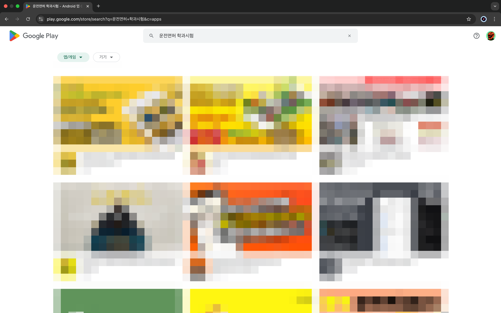
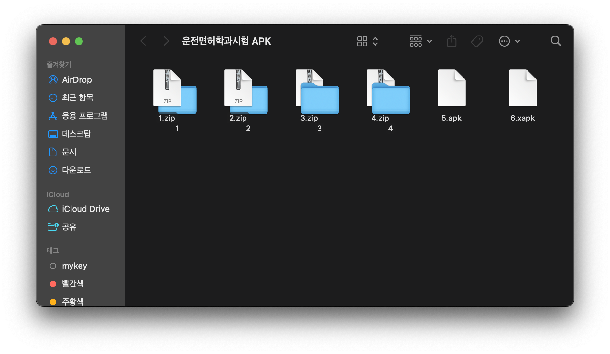
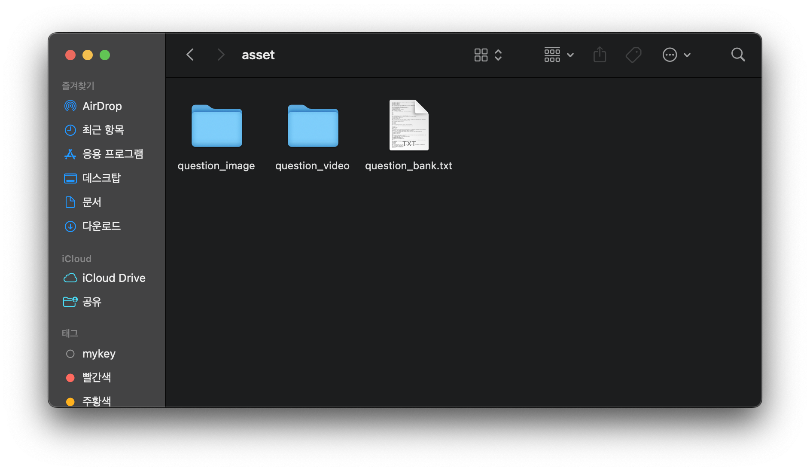

## ✋ 들어가며
한국도로교통공단에서는 운전면허 학과시험의 문제은행을 제공하며 문장형, 일러스트형, 사진형, 안전표지형, 동영상형 문제가 총 1,000문제로 구성되어있다.
이 중에서 유형별로 정해진 수를 랜덤으로 뽑아서 출제되는데 1종과 2종의 문제는 같고 합격 점수가 1종은 70점, 2종은 60점으로 되어있다. 

## 🤬 나한테 왜 그랬어..
PDF로 제공되는 문제 은행을 한땀 한땀 데이터화하고 기분좋게 위 '들어가며'를 작성하고 긴 명절 휴가를 다녀왔다.

> 💣 *그 사이에 문제은행이 변경됐다..*

과거의 데이터로 서비스를 제공할 수 없으니 PDF 파일에서 텍스트 따로 이미지를 따로 뽑아내고 동영상은 또 홈페이지에서 하나 하나 내려받았던 이 귀찮은 작업을 다시해야했다.  
어디가 어떻게 변경되었는지 상세하게 알려주기라도하면 좋을텐데.. ~~너무하네 진짜로~~

## 📂 데이터를 어떻게 만들어낼까?

#### ***문제은행 PDF 분석***
 파일을 열면 어떤식으로 데이터화를 해야할지 정말 막막하다. 사실 여러번 열어도 막막한데 그 이유를 살펴보자.

- 생각보다 PDF 문서의 스크롤 압박이 심하다. (양이 많다.)
- Excel 처럼 문서가 정형화되어있지 않아서 패턴을 찾기 어렵다.
- 문제 번호가 없는 등 오타가 꽤 많이 숨어있다.
- 문제의 유형이 다양하다. (이미지가 해설에 포함된 경우, 문제에 포함된 경우, 1개인 경우 2개인 경우, 이미지 설명이 N개 있는 유형 등)
- 동영상 문제는 홈페이지를 확인하라고 되어있다. 
- 기타 등등

#### ***다른 개발자들은 어떻게 했을까?***
  

일단 막막한 마음을 조금이라도 해소하기 위해서 다른 앱들을 열어서 보기로 했다.
무언가를 만들때 아이디어를 얻기 위해서 관련된 앱들을 순위에 상관없이 최대한 많이 받아서 사용해보는 편이다.

안드로이드 플레이스토어에서 `운전면허 학과시험`을 검색하면 많은 앱들이 나오는데 많은 앱을 다운받아서 사용해봤다.
완성도가 높은 앱들도 많이 있었다. 과연 내가 더 완성도 높은 앱을 만들 수 있을까? (1등을 못하면 10등이라도 하자..^^)

내가 가장 많이 사용할거라고 생각한 연령대는 고등학교를 갓 졸업한 20살부터 20대 초반이라고 생각했다. 그래서 최초 다운로드 이후에 데이터를 최대한 사용하지 않는 안드로이드 APK의 압축을 풀어봤다. 

많은 앱들이 데이터를 사용하지 않기 위함이거나 서버를 사용하지 않는 앱을 제작하기 위해서 문제은행, 이미지 동영상 등의 에셋을 앱에 포함시켜놓았는데
과거의 문제은행으로 만들어져서 사용할수는 없지만 보통은 텍스트 파일 형태로 텍스트에 구분자를 두는 형식으로 데이터를 관리하고 있었다.

결국 남의 앱을 열어도 수동으로 변환했을 것 같은 데이터들이 많아서 변환에 대한 아이디어를 얻을 수 없었지만 적어도 내가 만들게될 앱은 누가 APK를 열어봐도 알아볼 수 없도록 양방향 암호회를 진행해야겠다는 생각이 들었다.

## 👋 마치며
글이 너무 길어지는 것 같아서 실제 데이터를 만들어내는 작업에 대한 내용은 다음 포스팅에서 이어가도록 하겠다.