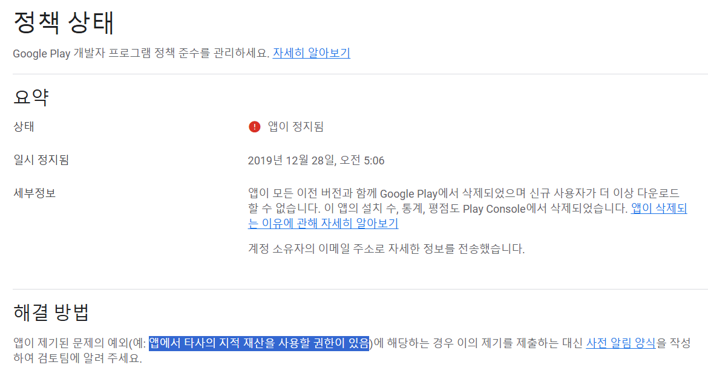
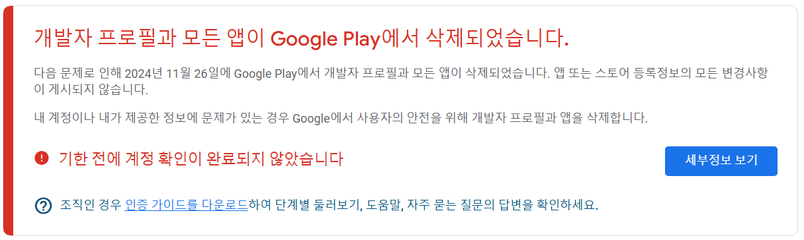

## ✋ 들어가며

처음 개발자로 일하기 시작했을때는 주로 WebView 기반의 Android, iOS 모바일 하이브리드 앱을 주로 개발하다가 시간이 흐를수록 모바일 개발은 손을 떼고 Java 기반의 웹어플리케이션을 주로 개발해왔다.
지금은 DevOps를 주로 다루고 있지만 가볍게(?) 나만의 서비스를 만들어보면 어떨까 하는 생각이 들어서 무작정 시작해보려고 한다. 

## 🫗 역사 속으로 사라진 나의 앱(들)

나만 아는 역사이긴 하지만 이미 20~30개 정도의 앱을 출시해본 경험이 있다. 지금은 계정이 2개나 정지당하고 앱 역시 역사 속으로 사라졌다. 

#### ***첫번째 시도***

나의 첫번째 시도는 2017년, 그 당시 표현으로 '똥을 눌때도 들어오는 돈'을 벌기위해서
과감하게 안드로이드 개발자 계정을 구매했지만 아이디어가 없었던 나는 일단 라이센스에 문제가 없는 오픈소스를 찾아서 이름만 바꾼 앱을 출시했다.

신기하게도 만드는데 1시간도 걸리지 않은 앱이 첫 달에 400원 정도의 수익이 생겼다. 

이렇게 10개를 찍어내면 4000원, 100개를 찍어내면 40,000원이 아닌가? 
근거가 하나도 없는 자신감이 생기고 희망이 보이기 시작했다. 

> 💣 ***이럴수가?***
>   
> 1개를 출시 했을때 400원이었던 수익이 10개를 출시 했더니 그대로 400원이었다.

~~이렇게 조기 은퇴의 꿈이 좌절됐다.~~

#### ***N번째 시도 (부끄러운 과거..)***

2018년에는 지금까지 평생 만들었던 앱 중에서 가장 큰 수익을 안겨주었던 앱이 만들어졌다. (약 1만 다운로드)

이때는 취미로 사진 동호회를 운영하면서 사진을 좋아하는 많은 사람들을 만나고 고민을 나누던 시기였다.
사진을 좀 잘 찍으시는 분들의 최대 고민은 `누군가 내가 인스타그램에 올린 사진을 허락없이 도용한다는 것`이었다.

인스타그램은 사진 저장이 막혀있는데 어떤 방식으로 다운로드를 하는지 궁금증이 생겼다.

> ⚠️ 아니 이렇게 불편하게 남에 사진을 다운받는다고?

당시 다른 앱이나 서비스들은 인스타그램 앱에서 공유하기 버튼을 눌러서 주소를 복사한 후 다운로드 앱으로 들어가서 붙여넣으면 사진이 저장되는 방식이었다.
그래서 경쟁 앱보다 편안하게 남에 사진을 다운받을 수 있는 앱을 제작했다.

내가 만들었던 앱을 실행하면 인스타그램 모바일 화면이 WebView 형태로 출력되고 Javascript를 이용해서 사진 위에 저장 버튼을 위치시켰다.
인스타그램의 화면과 똑같은데 저장버튼이 추가되었던 것이다. 

꼬린내 나는 앱 중에서는 가장 편한 사용자 경험을 제공했던 것 같다.
그래서 그런지 다운로드 수가 점점 늘어가고 1만 다운로드를 넘어섰을 때 누군가의 신고로 앱이 삭제됐다.

이후에도 정신을 못차리고 꼬린내 나는 앱들을 계속 제작했다. (e.g. WebView 기반으로 제작 후 승인이 나면 유튜브 다운로더로 둔갑해버리는 그런 앱들..)

당연한 결과지만 그렇게 잦은 신고를 당하고 잦은 이의 신청을 하면서 첫번째 개발자 계정이 정지됐다.

#### ***N+1번째 시도***

이때는 오픈된 데이터를 어떻게 활용할지에 대한 관심이 많은 시기였다.
가장 먼저 나의 관심을 끌었던 데이터는 도로교통공단에서 제공하는 '운전면허 학과시험 문제은행'이었다.
운전면허 학과시험은 지금도 동일하게 공개된 1000문제 중에서 유형별로 총 40문제가 똑같이 출제되고 있다.

그래서 공개된 데이터를 기반으로 운전면허 학과시험 모의고사 앱을 제작했는데 완성도가 좋지 않은 앱인데도 생각보다는 수요가 있었다.

이렇게 또 희망이 보이기 시작하고 똑같은 UI를 활용해서 정보처리기사, 컴퓨터활용, 공인중개사 등 각종 기출문제 모의고사 앱을 제작해왔는데
어느 순간 자격증 시험이 모두 CBT로 변경되면서 기출문제의 개념이 사라지고 업데이트하지 못한 앱들은 열기가 식기 시작했다.

그러면서 나의 열정도 없어져버리고 관리하지 못한 개발자 계정은 두번째 정지를 맞이했다.

## 👀 그래서 뭘 만들건데?

글이 너무 길어졌지만 결론은 아직도 도로교통공단에서 공개하고 있는 '운전면허 학과시험 문제은행'을 활용해서 다시 한번 운전면허 학과시험 모의고사 앱을 제작해보려고 한다.
과거에는 안드로이드 플레이스토어에만 출시했지만 이번에는 안드로이드와 iOS에 모두 출시를 목표로 한번도 사용해보지 않은 [Flutter↗](https://flutter.dev/)를 활용할 예정이다.

## 👋 마치며
Flutter의 'F'도 모르지만 그렇게 깊게 공부할 생각은 아직 없다. (어쩔 수 없는 이 ~~불량한 태도~~)
 그저 이 시리즈의 제목처럼 일단 해보자는 마음으로 무작정 시작해보겠다.