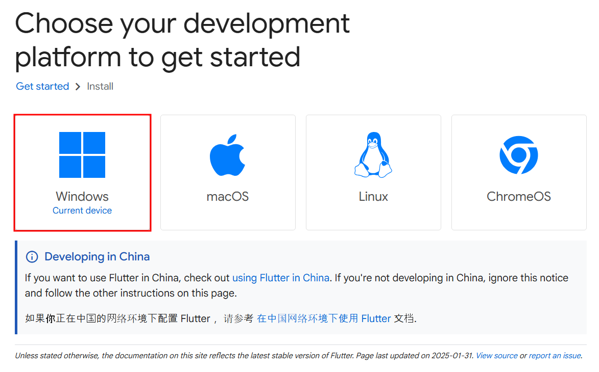
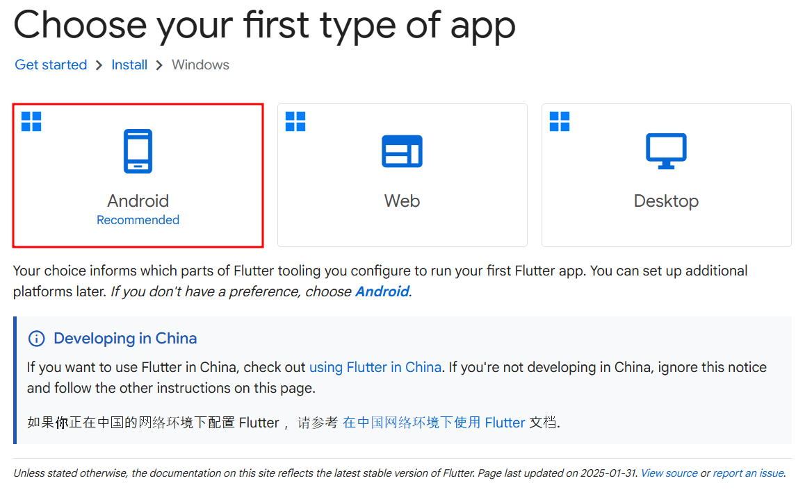
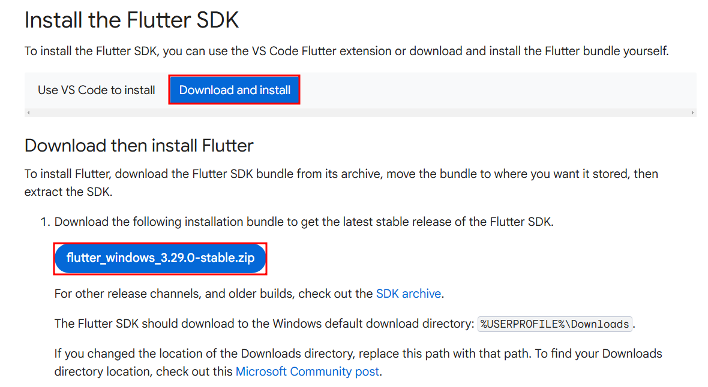
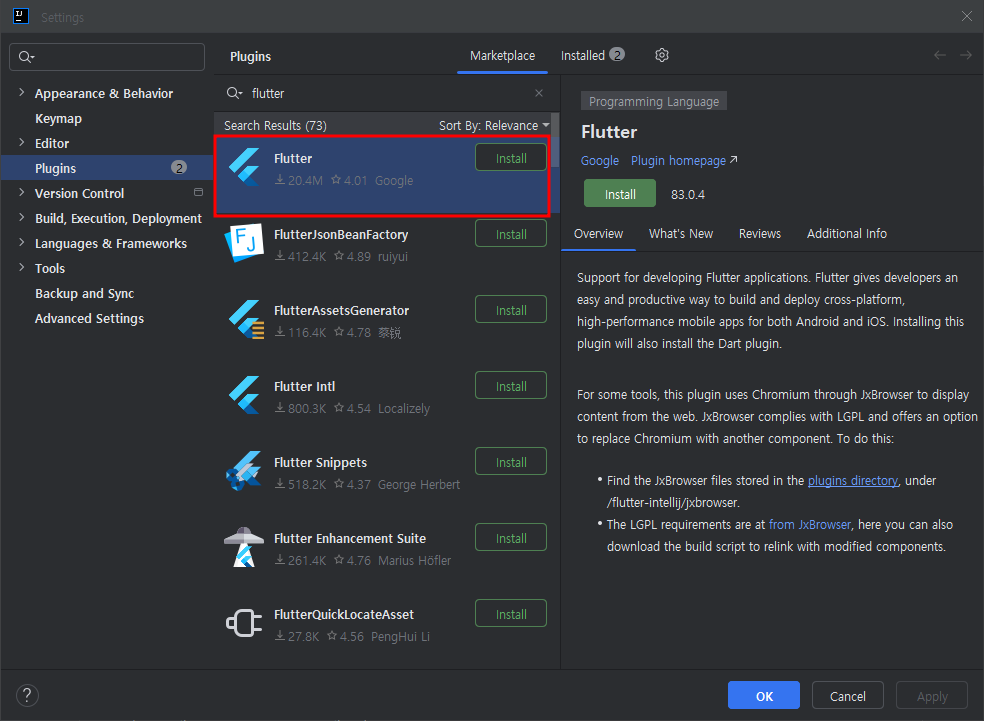
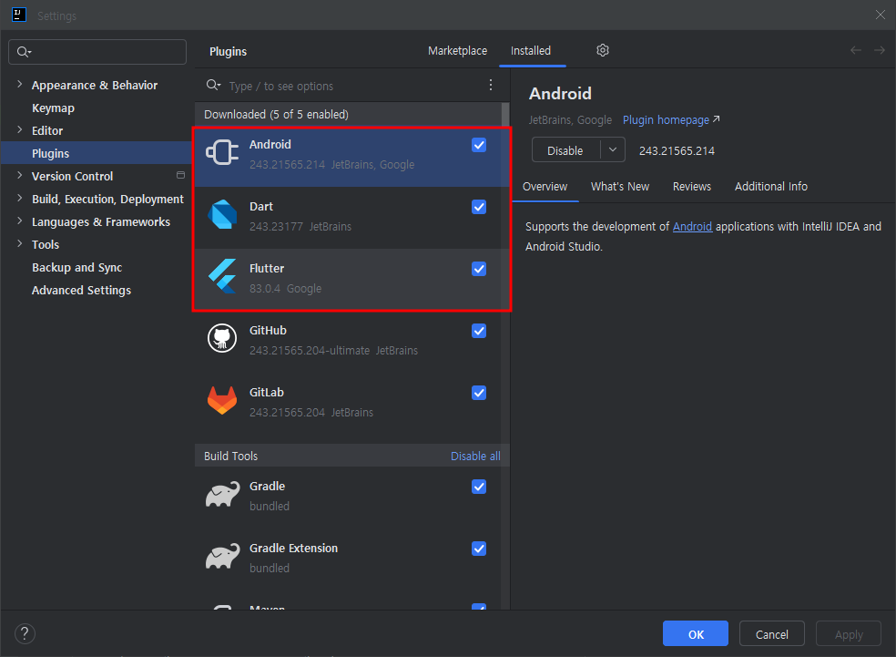
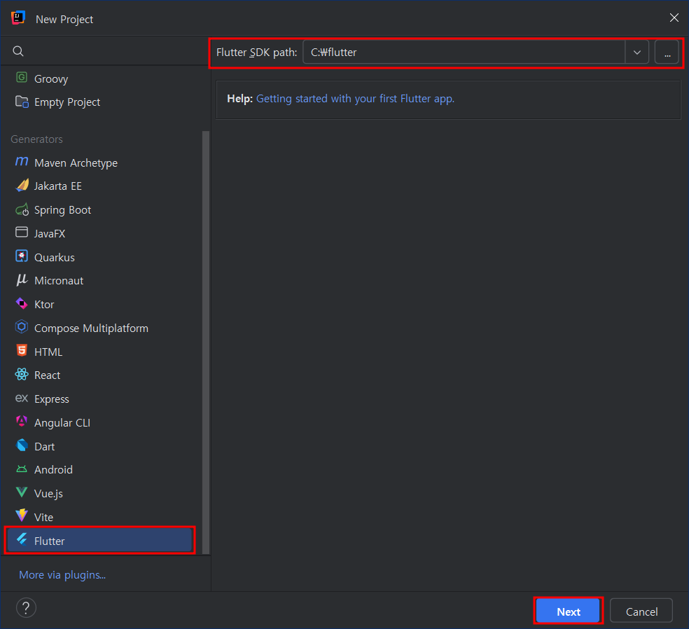
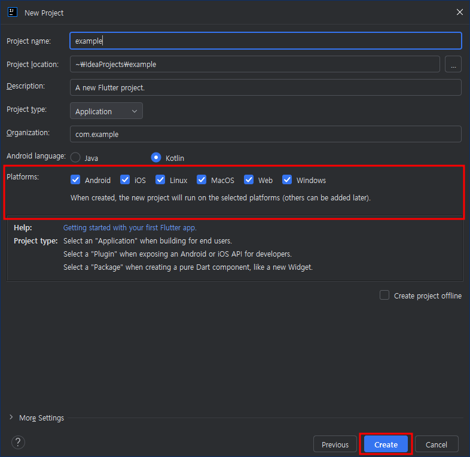
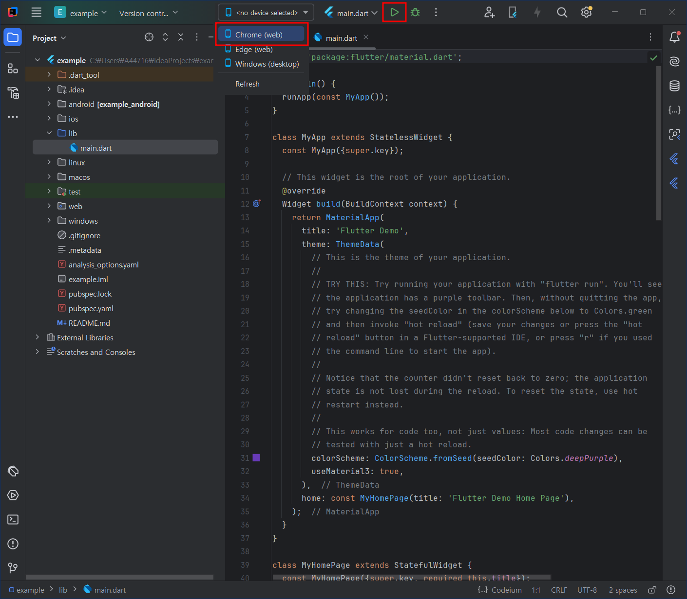
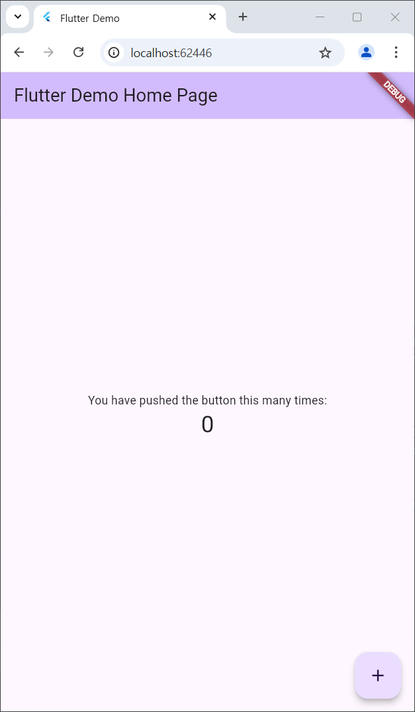

> ☀️ ***테스트 환경***
>   
> - Windows 11 Pro
> - IntelliJ IDEA 2024.3 (Ultimate Edition)

## ✋ 들어가며
`무작정 모바일 앱 출시하기` 시리즈를 진행하면서 팔자에도 없던 Flutter 환경 설정의 맛을 조금 봤다.
글을 작성하는 환경은 Windows지만 MacOS에서도 거의 동일하게 세팅이 가능해서 내용을 공유해보려고 한다.

## ❓ IntelliJ를 왜 선택했나
Flutter 공식 문서에는 `Visual Studio Code`를 사용하는 방법과 `Android Studio`, `IndelliJ IDEA`를 사용한 개발환경 구성 방식이 인기있는 옵션이라고 소개하고 있다.

필자는 VSCode는 별로 선호하지 않고 익숙하지 않은데다가 무려 JetBrains를 신봉하는 사람이다.
그럼 선택지가 Android Studio와 IntelliJ가 남아있는데 어차피 IntelliJ로 만들어져있는 Android Studio는 사용하지 않기로 했다.

## 🎯 Flutter 개발환경을 설정해보자
Flutter 개발환경을 가볍게 구성해보고 `Hello World!`와 같은 첫 페이지를 띄워보는게 이번 게시글의 핵심이 되겠다.

#### ***1. Flutter SDK 다운로드***
- [공식 설치 가이드↗](https://docs.flutter.dev/get-started/install)에 접속 후 아래 과정을 따라가보자.

- 현재 설치하고자 하는 플랫폼을 선택한다.

  

- 지금 단계에서는 Flutter SDK를 다운받는게 목표이기 때문에 앱 유형은 크게 상관없다.

  

- 아래와 같이 최신버전의 Flutter SDK를 다운받을 수 있다.

  

- 다운받은 압축파일을 적당한 위치에 압축을 풀어놓으면 끝 (e.g. `C:\flutter`)

#### ***2. IntelliJ Plugins 설치***
- `Settings ➡ Plugins`에서 flutter를 검색 후 설치한다.

  

- 아래와 같이 `Android`, `Dart`, `Flutter`가 한번에 설치되었음을 알 수 있다. 

  

#### ***3. 신규 프로젝트 생성***
- 새프로젝트를 생성하고 위에서 압축을 풀었던 Flutter SDK 경로를 넣어준다.

  

- 지원할 플랫폼 등의 필수 요소들을 입력하면 끝이다.

  

#### ***4. Hello World!***
- 환경설정이 정상이라면 아래와 같은 화면이 나오는데 실행할 Device를 선택 후 실행 버튼을 눌러준다. (Web Browser, Android Emulator, iOS Simulator, Physical device 등을 지원)

  

- 잠시 기다리면 `Hello World!`라고 부르기에는 너무 거창한 초기 화면이 보여진다. 심지어 `+` 버튼을 누르면 숫자가 올라간다.

  

## 👋 마치며
이렇게 팔자에도 없던 Flutter의 개발환경을 구성해봤는데, 한가지 소스로 멀티 플랫폼을 지원한다는게 너무 만족스럽다.
하지만 아무리 멀티 플랫폼을 지원하더라도 디자인에 센스가 제로에 가까워서 예쁜 앱을 만들어내기에는 힘들 것 같다. (~~그래서 대충 만들기로 나 자신과 협의했다~~)