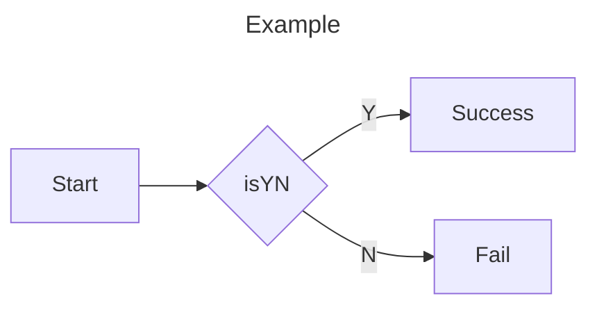
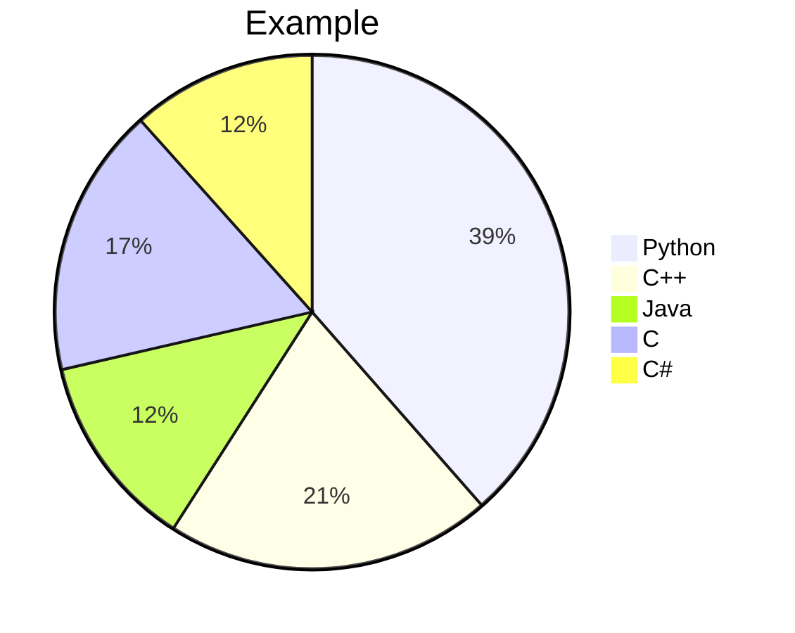
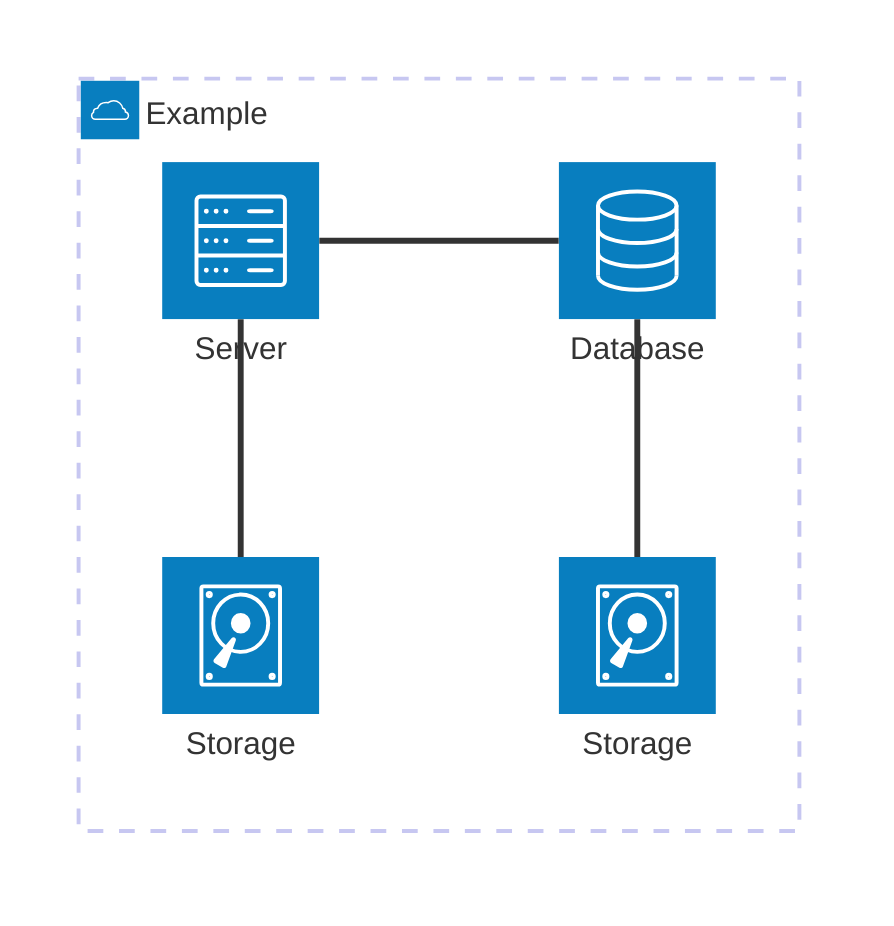
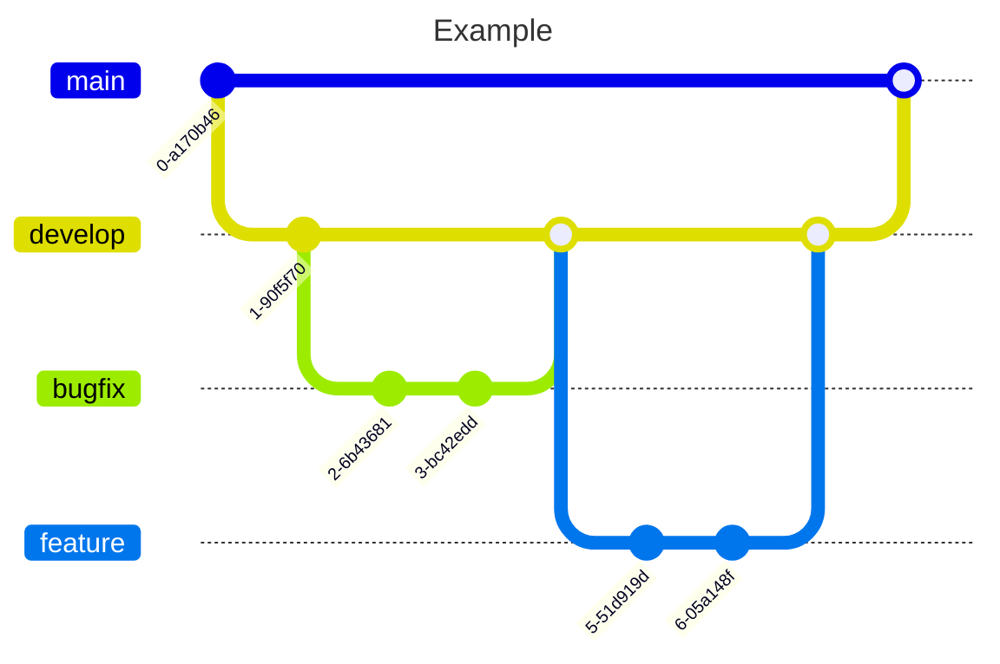

## ✋ 들어가며
필자가 계속 업데이트 사용하고 있는 [Gatsby Blog 테마↗](https://github.com/rundevelrun/gatsby-starter-rundevelrun)에도 Mermaid 문법을 지원하도록 업데이트 되었다.
기술 블로그를 운영하다보면 다이어그램이나 플로우차트를 포함한 다양한 차트를 그려서 설명해야하는 경우가 생긴다. 이미지를 제작 후 삽입하는 형태보다 Mermaid 문법을 사용하면 좋을 것 같아서 소개해보려고 한다.


## ☀️ 테스트 환경
> - NodeJS v22.13.0
> - yarn 1.22.22

## 🔎 Mermaid란 무엇인가
Mermaid는 JavaScript 기반의 다이어그램 및 차트 도구로,
마크다운에 작성된 텍스트를 렌더링하여 다이어그램을 동적으로 생성할 수 있는 도구라고 [공식문서↗](https://mermaid.js.org/intro/)에 소개되어있고 AI 친구에게 번역을 부탁한 후 그대로 가져왔다.

## 🧜 Gatsby에 Mermaid 플러그인 설치하기
[Gatsby Blog 테마↗](https://github.com/rundevelrun/gatsby-starter-rundevelrun)를 사용하고 있다면 Mermaid 플러그인이 설치되어있지만 그렇지 않은 방문자를 위해 아주 간단한 설치방법을 소개해보겠다.


#### ***의존성 패키지 설치***

`package.json`에 의존성 패키지를 추가하고 설치를 진행한다. 

```json
...
  "dependencies": {
    "gatsby-remark-mermaid": "^5.0.0",
    "playwright": "^1.50.1",
...
```

#### ***gatsby 설정 수정***

`gatsby-config.js`의 gatsby-transfomer-remark 하위에 gatsby-remark-mermaid를 추가하면 끝.
```js
module.exports = {
  plugins: [
  {
    resolve: `gatsby-transformer-remark`,
    options: {
      plugins: [
        `gatsby-remark-mermaid`,
...
```

## 📝 Mermaid 문법 사용하기
Flowchart, Gantt, Kanban, Mindmaps, Git 등 다양한 다이어그램 문법을 지원하는데 몇개만 살펴보도록 하겠다.

#### ***Flowchart 예제***

````
--- 
title: Example
---
flowchart LR
    A[Start] --> B{isYN}
    B -- Y --> C[Success]
    B -- N --> D[Fail]
````



#### ***Pie Chart 예제***
````
```
pie title Example
    "Python": 20.17
    "C++": 10.75
    "Java": 6.45
    "C":8.89
    "C#":6.08
```
````



### ***Architecture 예제***

````

````


#### ***Git Diagram 예제***

````


````




## 👋 마치며
소개한 다이어그램과 차트 외에도 아주 다양한 문법을 지원하고 있는데 어디에 써먹으면 좋을지는 모르겠지만 Git Diagram이 뭔가 마음에 든다.
언젠가 활용할 날을 기대하며..