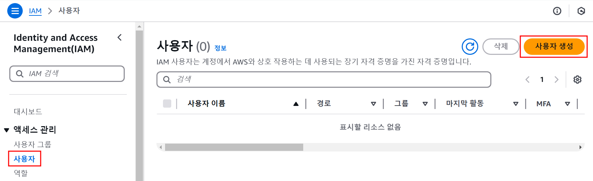
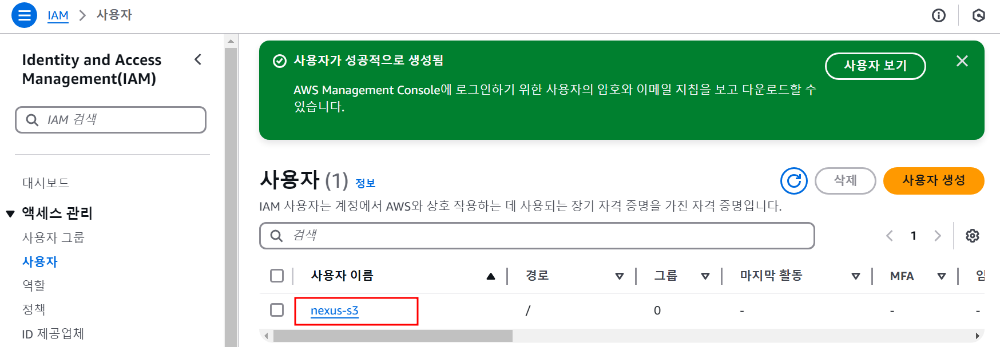
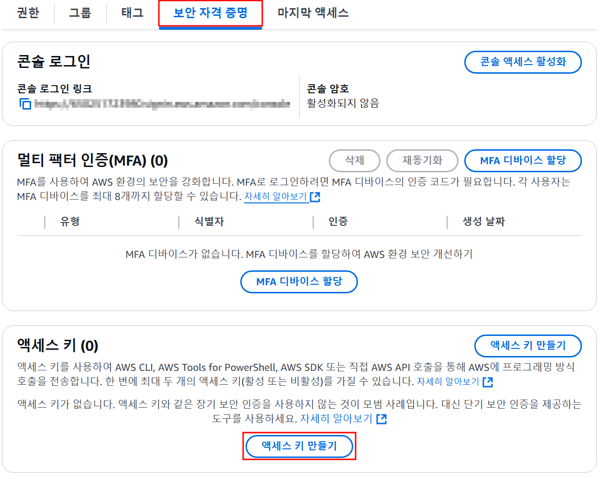

## ☀️ 테스트 환경
> - AWS S3
> - Nexus 3.75.1-01

## ✋ 들어가며
아직 Nexus가 설치되어있지 않다면 [이전 포스팅↗](/linux-swap-memory)을 확인  
Nexus를 설치했다면 데이터의 저장 위치를 설정해주어야 한다. 기본적으로는 Nexus 설치 위치 하위(*sonatype-work/nexus3/blobs*)에 구성이 되겠지만 이 포스팅에서는 일반 저장소보다 저렴한 S3를 활용하려고 한다.

## 🔑 IAM 권한 사용자 생성 및 액세스 키 발급

이 단계에서는 S3에 Access 할 수 있는 권한 사용자를 생성하고 Nexus 연동을 위한 AccessKey를 발급받는다.

#### ***사용자 생성***

1. 관리 계정으로 로그인 후 `보안 자격 증명` 메뉴 선택

   

2. *IAM ➡ 사용자 ➡ 사용자 생성*

   

3. 사용자 이름 입력

   

4. 권한 옵션은 `직접 정책 연결`로 선택하고 권한 정책에는 `AmazonS3FullAccesss` 정책을 선택한다

   

5. 입력 값들은 검토 후 사용자 생성을 완료한다

   

#### ***Access Key 발급***
위 단계에서 S3 접근 권한 사용자를 생성했다면 접근할 수 있는 Access Key를 발급해야한다.  
이 과정은 AWS Console에서 이루어진다

1. *IAM ➡ 사용자* 에서 생성한 사용자 선택

   
2. 하단 `보안 자격 증명` 탭에서 `액세스 키 만들기`를 선택

   
3. 사용 사례는 `CLI` 선택

   
4. 설명 태그 입력 후 `액세스 키 만들기` 클릭

   
5. 아래 화면과 같이 액세스키가 출력되는데 csv 파일로 다운로드하거나 키를 저장해두어야 한다

   

## 🔗 Nexus Blob Store에 S3 연결
사용자 설정이 끝났다면 Nexus 관리자 페이지에서 간단하게 S3 Blob Store를 생성해주자

#### ***Blob Store 생성***

1. 관리계정으로 로그인 후 ⚙️ 화면으로 들어가서 *Blob Stores ➡ Create Blob Store* 클릭

   
2. 당연하게도 필수 입력값인 `Type`을 `S3`로 선택한다

   
3. 생성할 S3의 정보를 입력한다 (Bucket에 입력한 이름으로 S3 Bucket이 생성된다)

   
4. 마지막으로 AWS Console에서 발급받았던 Access Key, Secret Access Key를 입력해준다

   
5. 아래와 같이 생성되었다면 성공

   

#### ***S3 Bucket 확인***
넥서스 관리 페이지에서 입력한 이름의 S3 Bucket이 생성된걸 확인 할 수 있다

   

## 👋
EC2에 마운트되는 SSD등의 스토리지보다 S3가 가격적인 측면에서 큰 차이로 저렴하기 때문에
서버의 용량 증설을 고려할때 S3도 함께 생각해보면 좋을 것 같다
